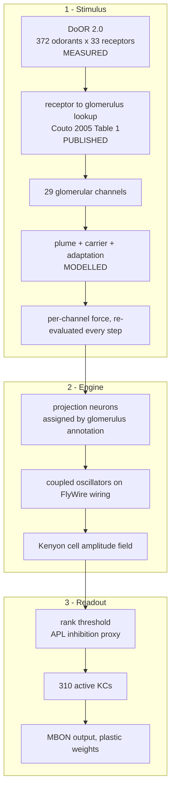

# Architecture

**Date**: 2026-03-24
**Last Updated**: 2026-09-05 (rewritten against the current state; the previous
version asserted withdrawn results as discoveries)
**Author**: Vladyslav Byelozerskykh
**ORCID**: 0009-0009-4741-2663

How the system is put together, what each stage does, and which parts are measured
data as opposed to modelling choices.

For results see the [README](README.md). For what the numbers cannot support see
[docs/03_validation/LIMITATIONS.md](docs/03_validation/LIMITATIONS.md).

---

## Contents

1. [What this is](#1-what-this-is)
2. [The three stages](#2-the-three-stages)
3. [Connectome substrate](#3-connectome-substrate)
4. [Stimulus path](#4-stimulus-path)
5. [Wave engine](#5-wave-engine)
6. [Readout](#6-readout)
7. [Determinism](#7-determinism)
8. [Performance](#8-performance)
9. [Learning and plasticity](#9-learning-and-plasticity)
10. [Inverse problem](#10-inverse-problem)
11. [Measurement harness](#11-measurement-harness)
12. [Results](#12-results)
13. [Other pathways](#13-other-pathways)
14. [What this is not](#14-what-this-is-not)
15. [File reference](#15-file-reference)

---

## 1. What this is

A simulator that evolves activity across the measured wiring diagram of an adult
*Drosophila* brain, driven by measured odour-receptor responses.

Each neuron is a damped oscillator carrying a phase and an amplitude rather than a
membrane voltage and a set of ion-channel variables. That makes a timestep a handful
of operations over flat arrays, which is what allows a 139,255-neuron connectome to
be loaded and a 9,199-neuron subgraph simulated on a laptop.

The model class is not new. Phase-oscillator models on structural connectomes are
standard in human whole-brain modelling, and Kuramoto at one-oscillator-per-neuron on
the full FlyWire connectome is published (Ódor, Deco & Kelling 2022, *Phys. Rev.
Research* 4:023057; 2025, arXiv:2503.20708, 124,891 nodes). What is uncommon here is
driving such a model with real receptor data and scoring it against published
olfactory measurements.

## 2. The three stages



The three stages are independently swappable, which is what made the September 2026
work possible: the input projection was replaced without touching the engine or the
readout, and the effect was attributable.

**Provenance of each part** - this distinction matters more than any single number:

| Component | Status |
|---|---|
| Wiring, neuron positions, cell-type annotations | measured (FlyWire EM reconstruction) |
| Odour receptor responses | measured (DoOR 2.0 meta-analysis of published recordings) |
| Receptor-to-glomerulus assignment | published lookup (Couto et al. 2005) |
| Plume, carrier, receptor adaptation | modelled, time constants from the literature |
| Channel count, carrier frequencies, coupling form, readout threshold | modelling choices |

## 3. Connectome substrate

**File**: [`hive/substrate/connectome.py`](hive/substrate/connectome.py)

Source: FAFB / FlyWire, Princeton v783 export, adult female.

| File | Content |
|---|---|
| `neurons.csv.gz` | 139,255 neurons with neurotransmitter profiles |
| `coordinates.csv.gz` | 3D positions |
| `consolidated_cell_types.csv.gz` | cell-type annotations |
| `connections_princeton.csv.gz` | 5,342,446 weighted edges |

### Edges are not synapses

Each row of the connections file is keyed on `(pre_root_id, post_root_id, neuropil)`
and carries a `syn_count`. So:

- **5,342,446 edges**
- **50,666,648 synapses** when the weights are summed, mean 9.48 per edge

The published FlyWire figure is 139,255 neurons and 54.5 M synapses (Dorkenwald et
al. 2024, *Nature* 634:124–138), so this export accounts for **93 %** of the
published synapse total, the remainder being its cleft-score and proofreading
thresholds. The neuron count matches exactly. Earlier versions of this document
called the 5,342,446 figure "synapses"; it is the edge count.

Loading parses the four gzipped CSVs in 2–3 minutes and caches to a pickle for
instant reload thereafter.

### Pathway extraction

**File**: [`hive/substrate/olfactory_subgraph.py`](hive/substrate/olfactory_subgraph.py)

Two classification modes, because the loose one over-matches:

| | loose (`strict=False`) | strict (`strict=True`) |
|---|---|---|
| neurons | 10,906 | **9,199** |
| edges | 446,388 | **318,577** |
| ORN | 2,279 | 2,279 |
| PN | 2,198 | **866** |
| LN | 721 | 448 |
| KC | 5,279 | **5,177** |
| APL / MBON / DAN | 2 / 96 / 331 | unchanged |

The loose mode matches by substring, and both of its tests over-match measurably:

- `'PN' in cell_type` matches 854 neurons, of which 289 are uniglomerular olfactory
  PNs and 264 are multiglomerular; **93 auditory wedge neurons (`WEDPN*`) and 161
  unnamed central-brain neurons (`CB####`)** also match.
- `'AL' in region` matches **4,796** neurons where only **2,762** are annotated `AL`.
  Region labels are dot-separated neuropil lists, and `LAL` — the lateral accessory
  lobe, a central-complex output region — contains those two letters. This is how
  `PFL3` (central complex) and `LC33` (visual) were classified as olfactory
  projection neurons.

Strict mode requires a whole dot-separated region token and rejects the
non-olfactory `PN` prefixes. It is **off by default**, because changing the subgraph
size makes results incomparable with every run recorded before 2026-09-05.

### Fan-in is the computational problem

Mean 40.9 edges per neuron; **maximum 14,662 onto a single neuron**; minimum 1–5 on
peripheral sensory neurons. A 358× spread. See §8 for why this defeats hand-written
GPU kernels.

### A known, unfixed defect

Coordinates are stored exactly as exported, in FAFB voxel/nanometre scale, so the
cloud spans roughly 445,000 × 303,000 × 231,000. Harmless for the sparse engine,
which uses positions only for clustering and distance-based delays. Fatal for
`ProbabilisticWaveBrain`, which derives a dense voxel grid from the bounding box: at
its documented 100 µm spacing that is ~31.3 billion voxels, ~116 GB per float32
field, and the process is killed. That engine carries a do-not-use banner. Not fixed
because rescaling would change the coupling distances every recorded run used.

## 4. Stimulus path

**File**: [`hive/interface/olfactory.py`](hive/interface/olfactory.py),
[`hive/data/door_client.py`](hive/data/door_client.py),
[`hive/data/receptor_glomerulus_map.py`](hive/data/receptor_glomerulus_map.py)

### 4.1 Receptor responses (measured)

`data/door_consensus_matrix.npy` holds a **372 × 40** matrix from DoOR 2.0 (Münch &
Galizia 2016, *Sci Rep* 6:21841), of which **33 columns carry data** and 7 are
all-zero padding (`Or56a`, `Or63a`, `Or83a`, `Or83b`, `Or98b`, `Gr21a`, `Gr63a`).
Values run −1 to +1; negative means the receptor is inhibited below its spontaneous
rate, and there are **478 such entries**. Only 28.1 % of the matrix is non-zero,
because most receptors ignore most molecules — that sparsity *is* the combinatorial
code.

### 4.2 Receptor to channel (three options, one of them biological)

| Option | What it is | Channels |
|---|---|---|
| `glomerular` | published one-to-one lookup, Couto et al. 2005 Table 1 | 29 |
| `sklearn_pca` | mean-centred PCA; the historical default | 20 |
| `uncentered_svd` | retained only to reproduce pre-2026-09-03 numbers | 20 |

In the animal, every sensory neuron expresses one tuning receptor and all neurons
expressing it converge on a single glomerulus (Vosshall et al. 2000), so the mapping
is a lookup rather than something to learn. 29 of the 33 measured receptors have a
citable assignment; four are **excluded rather than guessed** because no source could
be found, and `Or83b` is excluded because it is Orco, a co-receptor expressed in
nearly every sensory neuron and therefore having no glomerulus.

Measured cost of the PCA option, without running the simulation
(`results/final/glomerular_projection_diagnostic.json`):

| | measured receptors | PCA into 20 | one-to-one |
|---|---|---|---|
| mean pairwise similarity across the 12-odorant panel | 0.1845 | **0.5026** | 0.2134 |
| fraction of magnitude surviving the rectifier | 0.998 | **0.670** | 0.998 |
| RMSE against Campbell et al. 2013 Fig 4C | 0.1722 | **0.4702** | **0.1354** |

PCA inflates inter-odour similarity 2.72× and discards a third of the signal, because
component signs are arbitrary while the pipeline applies a ReLU.

### 4.3 Plume, carrier and adaptation (modelled)

Odour arrives in turbulent puffs, not as a steady concentration:

- **Whiff train** — intervals exponentially distributed with a 50 ms mean, durations
  averaging 30 ms, 5 ms rise and 20 ms decay within a whiff, plus an
  Ornstein-Uhlenbeck noise process (σ = 0.15, τ = 10 ms). Constants in
  `hive/config.yaml`.
- The envelope is a **scalar** multiplying the channel vector, so channel ratios
  survive a whiff: identity is stable while intensity varies.
- **Carrier** — a sinusoid per channel. Frequencies are *assigned*, not measured;
  there is no published per-glomerulus carrier frequency. `frequency_mode` selects
  between the historical 20-value spread (resampled by interpolation for other
  channel counts) and a uniform frequency.
- **Adaptation** — exponential decay toward a floor with a 200 ms time constant and
  500 ms recovery.

Reproducibility: the plume is drawn from a dedicated seeded stream in fixed 500 ms
chunks, chunk *k* seeded `seed + k`, with the global RNG state saved and restored
around generation. So the plume is a pure function of absolute time regardless of how
`evolve` calls are split, and every odorant sees the same realisation — which makes
odour-to-odour comparison controlled rather than confounded by turbulence.

### 4.4 Channel to projection neuron

| Mode | How |
|---|---|
| `glomerulus` | read the glomerulus off the cell-type annotation, so channel *k* drives exactly the neurons labelled `DM2_adPN` and so on |
| `position` | k-means on connectome coordinates, as a spatial proxy |
| `index` | position in the neuron list; no anatomical meaning, kept for comparison |

Under `glomerulus`, **137 projection neurons are driven**. That is close to the
anatomy — the annotations name 304 uniglomerular PNs in total across 60 glomeruli, so
29 glomeruli should reach roughly that many. Neurons naming no channel glomerulus
(multiglomerular `M_*` PNs, hygro/thermo `HRN_*`, and glomeruli no measured receptor
targets such as `DA1`) are **dropped from the drive and counted**, rather than
defaulted to channel 0.

## 5. Wave engine

**File**: [`hive/engine/sparse_probabilistic.py`](hive/engine/sparse_probabilistic.py)

Each neuron is a damped harmonic oscillator:

```
d²φ/dt² + 2γ·dφ/dt + ω₀²·φ = F_coupling + F_stimulus
```

with `γ = 0.1`, `ω₀ = 2π·10/1000` rad/ms (10 Hz), `dt = 0.1 ms`, forward Euler.
Coupling runs along the connectome:

```
F_j = Σᵢ wᵢⱼ · sin(φᵢ − φⱼ) · Aᵢ · c
```

Weights are synapse counts normalised by the maximum. `c = exp(−0.05)` is a constant.
Activity is read from the amplitude field, driven by `|velocity|`:

```
A ← A·(1 − γ·dt) + 0.1·|v|·dt
```

### 5.1 The engine is deterministic, despite the class name

The state dataclass carries `var_phase` and `var_amplitude`, and the class is named
`SparseProbabilisticBrain`. **Neither field participates in the dynamics:**

- `var_amplitude` is initialised to 0.01 and **never updated by any step function**.
- `var_phase` *is* updated every step and clipped, but the coupling multiplies by the
  hardcoded constant `c` above rather than reading the live field. It is write-only.
- Therefore **`sigma_noise` provably cannot change any output**, though it is
  recorded as a configuration parameter in every result file.

So this is a deterministic damped-oscillator network on a sparse graph. Earlier
versions of this document described it as mean-field Fokker-Planck; that overstates
what the code does. Not yet fixed — see LIMITATIONS §3.

### 5.2 Amplitude guard

`amplitude_max = 1e4`, and the bound is derived rather than picked. The amplitude
recursion has unit steady-state gain to `|v|`, and a damped oscillator under bounded
forcing satisfies `|v| ≤ F_max/(2γ)`; with the measured front-end drive that is
`|v| ≤ 30.3` against a measured peak of 12.28. The guard sits three orders of
magnitude above the reachable range, so it can catch a runaway while provably not
shaping the signal — and whether it binds is *tested*, not assumed:
`count_at_amplitude_ceiling()` returns 0 across the dt sweep.

This replaced a ceiling of 10.0, which sat *inside* the operating range. Under the
old constant drive all 981 driven PNs pinned at exactly 10.0, which made PN amplitude
identical at every concentration and forced concentration to reach the Kenyon cells
through phase alone.

## 6. Readout

`get_region_activity('KC', normalize_kc=True, target_sparsity=0.06)` applies a rank
threshold as a proxy for APL feedback inhibition (Lin et al. 2014): sort, take the
value at index `int(n_kc · 0.06)`, subtract it from every KC, clamp at zero.

That keeps exactly **316 of 5,279** KCs (loose) or **310 of 5,177** (strict) for
every stimulus, at every concentration. **Population sparseness is therefore a
parameter, not a result**, with standard deviation exactly zero. Consequences in
LIMITATIONS §1; the short version is that the threshold fixes *how many* neurons are
active and not *which*, so set identity remains an output while the sparsity level is
circular and nothing is claimed about it.

Region membership is resolved once and cached. That lookup previously cost 0.271 s
per call because a membership test ran against a list; it is now under 1 ms, with
bit-identical output.

## 7. Determinism

The single most consequential engineering problem in the project.

**Symptom.** Same code, same seed, different answers — 303 active KCs in one run and
203 in another, with 11 of 15 trials differing.

**Cause, and it is two-stage.** Coupling was accumulated with
`forces.at[post_idx].add(...)`, which lowers to an *unordered* atomic scatter-add over
446,388 edges on Metal. Floating-point addition is not associative and the hardware
guarantees no reduction order, so same-seed processes diverged by ~1e-8 per step. That
would be negligible, except the readout thresholds by **rank**: a reorder near index
316 shifts the baseline subtracted from all 5,279 KCs, turning an analog perturbation
into a different *set* of active neurons.

**What does not fix it.** Seeding — there is no RNG in the step. Sorting the scatter
indices — measured, 7.45e-9 of residual drift remains after a stable sort, because
the atomics are still unordered.

**The fix.** A static two-stage segment reduction (`_build_segment_layout`). Edges are
sorted by postsynaptic index once at construction and padded into 64-wide blocks so
no block straddles two neurons; the sum is then two fixed-shape axis reductions, which
have a deterministic reduction tree. The same layout drives the NumPy path, so both
backends perform the same additions in the same order.

**Cost.** 0.251 ms per call against 0.248 ms for the atomic scatter — about 1.2 % —
plus layout buffers of 2.8 + 8.0 MB (strict) or 3.6 + 9.6 MB (loose).

**Result.** Bit-for-bit identical across 5 same-seed trials on all four state fields
and the readout, on both backends (`results/final/mlx_determinism.json`).

**Honest cost of the layout.** Stage 2 is a padded rectangular gather sized by the
worst neuron: `ceil(14662/64) = 230` blocks, so all rows are 230 wide and roughly
99 % of that buffer is padding. It is free at this scale and would not survive the
full brain; a ragged CSR-style two-level reduction is the fix and has not been done.

**Cross-backend equality is impossible**, because `mx.sum` and `np.sum` use different
reduction trees. See §8 for how far agreement holds.

## 8. Performance

Apple M4 Pro, Python 3.14.3, olfactory subgraph, `dt = 0.1 ms`, 100 ms of simulated
biology, matched configuration, 5 timed repeats after warm-up
(`results/final/cpu_vs_mlx_speedup.json`):

| | wall time | real-time factor |
|---|---|---|
| MLX (Metal) | 0.4867 s median, SD 0.00045 | 0.205× |
| NumPy (CPU) | 4.8673 s median, SD 0.0080 | 0.0205× |
| **speedup** | **10.00× median** (9.958–10.026) | |

Slower than real time on both backends. The previously reported 86.3× is discarded:
its source file recorded 1,283 active KCs where current runs give 310–316, a null
pattern correlation, and `validation_passed: true` against a criterion it never
evaluated.

### Cross-backend agreement, and why reports use CPU

At 100 ms the two backends select the **same 62 active KCs**, Jaccard 1.0000, pattern
r = 0.99988. Agreement was then tested over 2,000 ms against a rule fixed **before
the run and recorded in the result file** — Jaccard ≥ 0.95 and r ≥ 0.99 at every
100 ms sample across 8 seeds, with the failure action pre-committed. **It failed:**
0.9627/0.9932 at 100 ms, 0.1902/0.5422 by 200 ms, worst case 0.1030/0.0650. So every
reported number comes from the 10× slower backend. Whether the divergence is bounded
chaos or a bug in one backend is undetermined.

### Why the library scatter beats hand-written kernels

Same equations, three languages, same exported connectome, 1,000 steps:

| Backend | Wall time | Failure mode |
|---|---|---|
| Python + MLX | **0.171 s** | library scatter: internal sort plus SIMD-group segmented reduction, insensitive to fan-in shape |
| Julia + Metal (CSR) | 3.314 s | one thread per neuron, so the hub thread runs 14,662 serial iterations while 10,905 idle. Metal.jl 1.9.3 has no float atomics, which forced CSR |
| Rust + Metal (CAS) | 6.188 s | one thread per edge balances the work, but 14,662 concurrent compare-and-swap writes land on one address |

This inverted the ranking a synthetic uniform-fan-in benchmark had given, where Rust
was far ahead. The bottleneck is the fan-in distribution, not the language.

**Throughput is unremarkable.** Per edge per second of simulated biology the MLX path
is roughly 1.8× slower than Shiu et al.'s reported figure and ~37× slower than the
Brian 2 reference in Sandia's Loihi 2 port. Nothing here is a performance result;
what the performance work bought was determinism and the diagnosis above.

### Memory

| | |
|---|---|
| State, 5 float32 per neuron | 0.2 MB (subgraph), 2.7 MB (full brain) |
| Edge indices and weights, 12 B per edge | 3.8 MB (strict), 5.1 MB (loose), 61 MB (full brain) |
| Segment layout | 10.8 MB (strict), 13.2 MB (loose) |

## 9. Learning and plasticity

KC→MBON weights are plastic. The rule is dopamine-gated depression restricted to the
KC→MBON synapses selected **by cell type**, not by index range:

```
Δw_ij = −η_d · A_KC(i) · D
```

Two variants are scored: `thresholded`, where `A_KC` is the post-readout activity,
and `raw`, where it is the raw amplitude field. There is no global weight
renormalisation — an earlier version divided all 446,388 weights by their maximum,
which collapsed the MBON response by 99.99 % and passed an unsigned 1 % change
criterion. A signal dying is not a memory forming.

### The readout is not monotone in synaptic weight

Measured across 11 weight scales × 8 trials
(`results/final/mbon_weight_monotonicity.json`):

| readout | Spearman ρ | monotone |
|---|---|---|
| MBON amplitude | **−0.0182** (p = 0.958) | no; peaks at *half* strength |
| KC→MBON coupling current | **1.0000** | yes |

Coupling is a phase-pulling term and amplitude is driven by `|velocity|`, so tighter
locking *lowers* amplitude. Hige et al. 2015 measures learning as a reduced MBON
response following depression, which presupposes monotonicity — so the benchmark
scores the coupling current, the analogue of that paper's Fig 3D charge-transfer
measurement, and the substitution is declared in the result file.

A regression test (`tests/test_weights_on_signal_path.py`) asserts that zeroing the
KC→MBON weights must change the MBON readout. It exists because a compiled MLX
closure once captured the weight array by value: zeroing all 49,599 weights changed
the output by exactly **0.000 %**, so every learning test on that path silently
trained nothing while passing.

## 10. Inverse problem

**File**: [`hive/inverse/smell_optimizer.py`](hive/inverse/smell_optimizer.py)

Given a target KC fingerprint, find the glomerular pattern that produces it.

The ODE integrator cannot be differentiated through — it round-trips via NumPy, which
severs the autodiff graph. So `DifferentiableSmellMapper` is a pure-MLX surrogate of
the dominant linear stage, built from the real connectome weights:

```
sigmoid(logits) → W_pn_glom @ glom · 50 → W_kc_pn @ pn_force → max(x − mean(x), 0)
```

Loss is cosine distance, because pattern *shape* encodes identity while magnitude
varies with concentration. Adam is hand-rolled on a bare logit array. Two modes:
`fast` (cosine nearest-neighbour over the fingerprint database, ~1 ms) and `gradient`
(~200 ms).

Two honest limits: gradient mode optimises the **surrogate**, not the simulator; and
`multi_start` is broken — it draws random starting logits and then never uses them,
so every restart runs the identical deterministic optimisation.

## 11. Measurement harness

**File**: [`benchmark_harness.py`](benchmark_harness.py),
[`benchmarks_repaired/`](benchmarks_repaired/)

The engine has no stochasticity in its step (§5.1), so under
`reset(deterministic=True)` the same stimulus at different seeds gives **bit-identical**
readouts. Repeats could not be averaged and the noise floor was exactly r = 1.0,
meaning any threshold below 1.0 declared a stimulus discriminable from itself.

The harness therefore uses `reset(deterministic=False)`, which randomises initial
phase — the engine's own signature default. That changes an initial condition, not a
model parameter. Measured replicate correlation: **r = 0.5658**.

Protocol, fixed in source before any run:

- **8 trials per stimulus**, seeds 1001–1008, declared as constants so no run can
  choose them after seeing an outcome.
- **12-odorant panel** selected by paper provenance only, each entry recording the
  published measurement it comes from.
- **Separability judged against the model's own within-stimulus replicate
  distribution**, never a fixed constant, with a one-sided Mann-Whitney test.
- **Seed-matched design with the same-seed diagonal excluded.** This is not
  fussiness: an unmatched design comparing one odorant on seeds 1001–1008 against
  seeds 2001–2008 reported it separable **from itself** at p = 0.0017, because
  consecutive seed blocks shift the mean by 0.06 and that reaches significance at
  56 within and 64 between pairs.

Every result file carries backend, timestep, γ, σ, neuron count, seed, git commit
with a `-dirty` suffix, platform, which projection ran and how much magnitude it
retained, the PN assignment report, and whether the odour drive was time-varying.
Unrecognised configuration keys **raise**, because the engine once accepted
`dt=0.01`, ran at `dt=0.1`, and recorded 0.01.

## 12. Results

Five benchmarks, each rebuilt on what its cited paper actually measures. Ablation
ladder over the input pipeline, with the engine, readout, criteria, seeds and panel
identical throughout:

| | projection | neurons | score |
|---|---|---|---|
| G0 | PCA into 20, k-means PN grouping, loose classifier | 10,906 | 2/5 |
| G1 | one-to-one glomerular, 29 channels | 10,906 | 4/5 |
| **G2** | + strict classifier | 9,199 | **5/5** |

Current (`results/final/all_validations_G2.json`):

| Benchmark | Result |
|---|---|
| Temporal dynamics | onset under 100 ms on 8/8 trials, all odorants; phasic p = 0.0039 — **PASS** |
| Odour mixtures | sub-additivity 0.5201 and 0.4926, both p = 0.0039 — **PASS** |
| Discrimination | series monotone 0.0505 → 0.3465 → 0.3759, both steps significant — **PASS** |
| Similarity | published ordering reproduced, ANOVA p = 2.6e-37; KC more separated than input in 59/66 pairs — **PASS** |
| Learning | all three criteria; specificity Cohen's d = 2.31 — **PASS** |
| Concentration invariance | r = 0.6603, **not scored** (no published threshold; the other quantity is pinned by the readout) |

Detail and confounds:
[docs/03_validation/GLOMERULAR_PROJECTION_REPAIR.md](docs/03_validation/GLOMERULAR_PROJECTION_REPAIR.md).
Target derivation:
[docs/03_validation/BENCHMARK_VALIDITY_AUDIT.md](docs/03_validation/BENCHMARK_VALIDITY_AUDIT.md).

**Read 5/5 correctly.** It is a correction to the *experiment* — the input is now the
input the animal has and the neuron populations are the ones the annotations name.
Two benchmarks pass at p = 0.0039, the floor for a one-sided Wilcoxon at n = 8, so
they are saturated rather than comfortable. And Kenyon cell identities do not
converge under timestep refinement (active-set Jaccard 0.4827 against a ten-times
finer step, non-monotone), so these are improved *comparisons*, not improved absolute
claims about which neurons are active.

### Digital smell database

**File**: [`hive/data/smell_database.py`](hive/data/smell_database.py),
[`scripts/batch_encode_odors.py`](scripts/batch_encode_odors.py)

372 odorants encoded to KC fingerprints, one canonical reproducible pattern per
molecule (deterministic reset, unlike the benchmarks). The artifact carries its own
configuration block. Lookup is O(1) by name, or cosine nearest-neighbour over an
L2-normalised `(372 × n_kc)` matrix.

## 13. Other pathways

Vision and auditory extractors exist and are **not** part of the scored suite. Their
numbers should be treated as unvalidated:

- **Vision** — a ~53,000-neuron optic-lobe extractor, and a 10-variable RK4 model of
  the photoreceptor cascade (`hive/vision/phototransduction.py`).
- **Auditory** — a Johnston's-organ subgraph and an AMMC→WED pathway.

Several previously reported vision and auditory figures do not come from the wave
engine at all — the T4 motion and HS/VS optic-flow results are the outputs of
hand-written directional filters, and the Johnston's-organ frequencies are recovered
from values assigned in a parameter table. Those are filter implementations, not
tests of the connectome. Two tests were withdrawn outright for supplying the expected
answer as an input and are preserved under `hive/validation/invalid/` with an
explanation.

## 14. What this is not

Stated explicitly because earlier versions of this document claimed otherwise.

- **Not a novel model class.** Phase oscillators on connectomes are standard in human
  whole-brain modelling; phase-plus-amplitude is the Hopf/Stuart-Landau model (Deco
  et al. 2017, *Sci Rep* 7:3095).
- **Not the first phase model on a fly connectome.** Ódor, Deco & Kelling published
  Kuramoto at one-oscillator-per-neuron on the hemibrain (2022) and on the full
  FlyWire connectome, 124,891 nodes, with RK4 and an adaptive stepper (2025).
- **Not the first connectome model of fly olfaction.** Lazar's group at Columbia has
  a program on the hemibrain mushroom body with APL feedback across 110 odorants, and
  obtains concentration invariance.
- **Not spiking, and not excitation/inhibition aware.** No spikes, no threshold, no
  refractory period, and the coupling carries no sign from neurotransmitter identity
  even though the connectome supplies it.
- **Not a performance result** (§8).
- **The previous §14 "Novel Discoveries" and §15 "Computational Firsts" have been
  removed.** They listed eight "firsts" and four "discoveries", the flagship being a
  decorrelation result of `r = −0.51` that was withdrawn — it was a six-point
  regression between chemical and neural similarity from a run the harness recorded
  as FAIL, and a later run measured the same quantity at `+0.632`, the opposite sign.
  The 27/27 benchmark score that appeared throughout was never produced by any run.

## 15. File reference

### Core

| File | Purpose |
|---|---|
| `hive/engine/sparse_probabilistic.py` | wave engine, MLX and NumPy backends, segment reduction |
| `hive/substrate/connectome.py` | FAFB loader |
| `hive/substrate/olfactory_subgraph.py` | pathway extraction, neuron classification |
| `hive/interface/olfactory.py` | plume, carrier, adaptation, glomerular mapping |
| `hive/data/door_client.py` | DoOR interface, three projections |
| `hive/data/receptor_glomerulus_map.py` | published receptor→glomerulus map with per-entry citations |
| `hive/data/smell_database.py` | fingerprint database and search |
| `hive/inverse/smell_optimizer.py` | differentiable surrogate and optimiser |
| `validation_utils.py` | engine construction, provenance, environment guards |
| `benchmark_harness.py` | shared trial protocol and null distribution |

### Benchmarks and diagnostics

| File | Purpose |
|---|---|
| `benchmarks_repaired/` | the five scored benchmarks |
| `scripts/run_repaired_suite.py` | scoring and configuration-agreement check |
| `scripts/run_glomerular_ladder.py` | ablation ladder |
| `tests/diagnose_glomerular_projection.py` | input-space projection diagnostic |
| `tests/test_benchmark_harness.py` | harness and null-calibration checks |
| `tests/test_weights_on_signal_path.py` | plasticity regression test |
| `tests/test_mlx_determinism.py` | same-seed reproducibility |
| `tests/test_dt_convergence_fixed_stimulus.py` | timestep convergence |
| `benchmarks/real_connectome/` | Python/Rust/Julia cross-language harness |

### Documentation

| File | Purpose |
|---|---|
| `README.md` | what the project is and current results |
| `docs/03_validation/LIMITATIONS.md` | what the numbers cannot support |
| `docs/03_validation/BENCHMARK_VALIDITY_AUDIT.md` | every target against its cited source |
| `docs/03_validation/GLOMERULAR_PROJECTION_REPAIR.md` | the input repair and ladder |
| `docs/03_validation/DETERMINISM_AND_STIMULUS_PATH.md` | determinism fix, per-fix ledger |
| `results/README.md` | which artifact backs which claim |
| `OUTDATED_FILES.md` | documents known to need updating |

*Independent, unreviewed work. Nothing here has been peer reviewed or published.*
