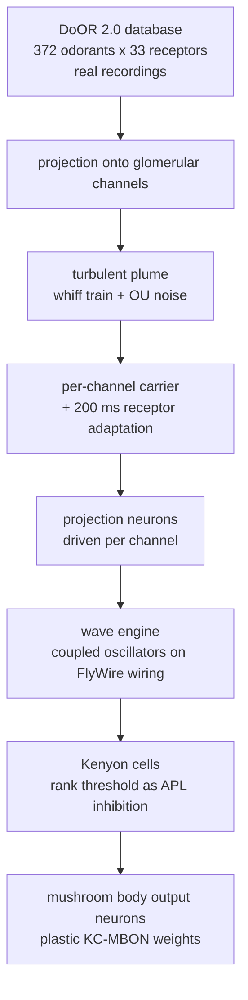

# Wave-based simulation of the Drosophila connectome

**Last Updated**: 2026-09-04

A simulator that runs activity across the real wiring diagram of a fruit fly
brain. Each neuron is modelled as a damped oscillator rather than as a spiking
cell, so the state is a phase and an amplitude per neuron instead of a membrane
voltage and a set of ion-channel variables. That makes every timestep a handful
of operations over flat arrays, which is what lets a 139,255-neuron connectome be
loaded and simulated on a laptop.

The concrete question it was built to ask: **if you take the measured wiring of an
animal's brain and drive it with the measured responses of that animal's odour
receptors, how much of the animal's olfactory behaviour falls out?**

Independent, unreviewed work. Nothing here has been peer reviewed, replicated by
anyone else, or published.

---

## How it works, end to end



Three ingredients with different provenance, and the distinction matters:

| Layer | Where it comes from |
|---|---|
| Wiring, neuron positions, cell types | **Measured.** FlyWire electron-microscopy reconstruction of an adult female brain |
| Odour receptor responses | **Measured.** DoOR 2.0, a meta-analysis of published electrophysiology and imaging |
| Plume, carrier, receptor adaptation | **Modelled**, with time constants from the literature |
| Receptor-to-channel projection, channel count | **A computational choice.** See below |

### How the smell input works

There is no downloaded "organ". The nose is three layers:

**1. Real measured data.** `data/door_consensus_matrix.npy` holds a
**372 odorants x 33 receptors** response matrix from **DoOR 2.0** (Munch &
Galizia 2016, Sci Rep 6:21841), fetched by
[`scripts/download_door_data.py`](scripts/download_door_data.py) from the DoOR
project's repository. DoOR is a meta-analysis: other labs recorded how each
receptor type responds to each molecule by single-sensillum recording and calcium
imaging, and DoOR merges those studies into one consensus table. Values run -1 to
+1, where negative means the receptor is inhibited below its spontaneous rate, and
only 28 % of entries are non-zero because most receptors ignore most molecules.
That sparsity is the combinatorial code.

**2. Written to mimic physics, with literature constants.** Odour does not arrive
as a steady smell, it arrives in turbulent puffs, so
[`hive/interface/olfactory.py`](hive/interface/olfactory.py) generates one: whiff
intervals drawn from an exponential distribution with a 50 ms mean, whiff
durations averaging 30 ms, a 5 ms rise and 20 ms decay inside each whiff, plus
Ornstein-Uhlenbeck noise. The whiff envelope is a *scalar* multiplying the odour's
channel vector, so channel ratios survive the puff and identity is stable while
intensity varies. On top of that sits a per-channel sinusoidal carrier, and
receptor adaptation as an exponential decay toward a floor with a 200 ms time
constant and 500 ms recovery.

The plume is stochastic but must be identical across odorants or comparisons are
confounded by which turbulence realisation each one drew. It is therefore drawn
from a dedicated seeded stream in fixed 500 ms chunks, chunk *k* seeded
`seed + k`, with the global RNG state saved and restored around generation - so
the plume is a pure function of absolute time regardless of how the run is split
up.

**3. A computational choice.** The receptors have to be mapped onto glomerular
channels, and two mappings are implemented:

- `projection='glomerular'` uses the **published one-to-one assignment** (Couto,
  Alenius & Dickson 2005, Curr Biol 15:1535, Table 1), which is what the animal
  has: every sensory neuron expresses one receptor, and all neurons expressing
  that receptor converge on a single glomerulus. 29 of the 33 measured receptors
  have a sourced assignment whose glomerulus also has projection neurons in the
  connectome. Channel identity is then a named glomerulus, and channel *k* drives
  exactly the neurons annotated with that glomerulus - `DM2_adPN`, `DA1_lPN` and
  so on. Per-receptor citations in
  [`hive/data/receptor_glomerulus_map.py`](hive/data/receptor_glomerulus_map.py).
- `projection='sklearn_pca'` compresses the receptors into 20 principal
  components. This is the historical default and it has no biological
  counterpart: a component is a direction of variance over whichever odorant panel
  was loaded.

## What was built

- **Connectome ingestion** - the FlyWire female brain, FAFB v783 Princeton export:
  139,255 neurons and 5,342,446 weighted edges.

  Those are *edges*, not synapses. Each row of `connections_princeton.csv.gz` is
  keyed on `(pre_root_id, post_root_id, neuropil)` and carries a `syn_count`;
  summing over all rows gives **50,666,648** synapses, 93 % of the 54.5 M
  published by Dorkenwald et al. 2024 (Nature 634:124-138), the remainder being
  the export's cleft-score and proofreading thresholds. The neuron count matches
  the published figure exactly. First load parses four gzipped CSVs in 2-3 minutes
  and caches to a pickle for instant reload.

- **Subgraph extraction** - the olfactory pathway: 10,906 neurons and 446,388
  edges, comprising 2,279 ORNs, 2,198 PNs, 721 LNs, 5,279 KCs, 331 DANs, 96 MBONs
  and 2 APL neurons. A visual pathway extractor exists for the optic lobe.

  The fan-in distribution is what makes this substrate awkward to compute on: mean
  40.9 edges per neuron, **maximum 14,662 onto a single neuron**, minimum 1-5 on
  peripheral sensory neurons.

- **Wave engine** ([`hive/engine/sparse_probabilistic.py`](hive/engine/sparse_probabilistic.py))
  - sparse coupled-oscillator integrator with an MLX (Apple GPU) backend and a
  NumPy CPU backend. Forward Euler, `dt = 0.1 ms`. Coupling is accumulated through
  a static two-stage segment reduction whose order is a pure function of the
  connectome, which is what makes both backends bit-for-bit reproducible at a
  fixed seed.

- **Receptor front-end** ([`hive/interface/olfactory.py`](hive/interface/olfactory.py))
  - the plume, carrier and adaptation described above, plus the glomerulus-to-PN
  assignment.

- **Measurement harness** ([`benchmark_harness.py`](benchmark_harness.py),
  [`benchmarks_repaired/`](benchmarks_repaired/)) - shared protocol for the
  benchmarks: 8 trials per stimulus on seeds declared in source, a 12-odorant
  panel where each entry records the published measurement it comes from, and
  every separability claim judged against the model's own within-stimulus
  replicate distribution rather than a fixed constant.

- **Provenance** ([`validation_utils.py`](validation_utils.py)) - every result file
  carries backend, timestep, gamma, sigma, neuron count, seed, git commit with a
  `-dirty` suffix, Python version, platform, which projection ran and how much
  magnitude it retained, whether the DoOR matrix is synthetic, the PN mapping used,
  and whether the odour drive was time-varying. Unrecognised configuration keys
  raise, so a result file cannot record a parameter the engine never applied.

- **Inverse problem** ([`hive/inverse/smell_optimizer.py`](hive/inverse/smell_optimizer.py))
  - given a target Kenyon-cell pattern, find the glomerular pattern that produces
  it, by gradient descent through a pure-MLX differentiable surrogate of the
  PN-to-KC stage.

- **Cross-language benchmark** ([`benchmarks/`](benchmarks/)) - the same step
  equations reimplemented in Rust/Metal and Julia/Metal against the same exported
  connectome binaries. See Performance.

## Architecture

Each neuron is a damped harmonic oscillator:

```
d²φ/dt² + 2γ·dφ/dt + ω₀²·φ = F_coupling + F_stimulus
```

with `γ = 0.1`, `ω₀ = 2π·10/1000` rad/ms, and coupling along the connectome:

```
F_j = Σᵢ wᵢⱼ · sin(φᵢ − φⱼ) · Aᵢ
```

Activity is read out of the amplitude field, which is driven by `|velocity|`.
State is five floats per neuron: 0.2 MB for the olfactory subgraph, 2.7 MB for the
full brain. The synapse index and weight arrays are 5.1 MB and 61 MB respectively.

**Determinism.** Coupling used to be accumulated with an atomic scatter-add, which
on Metal has no guaranteed reduction order. Floating-point addition is not
associative, so same-seed runs diverged by about 1e-8 per step - and because the
Kenyon-cell readout thresholds by *rank*, that became a different *set* of active
neurons rather than a slightly different number. Edges are now sorted by
destination once at construction and padded into 64-wide blocks, and the sum is
two fixed-shape axis reductions with a deterministic reduction tree. Both backends
are now bit-for-bit identical across repeated same-seed runs, on all four state
fields and the readout (`results/final/mlx_determinism.json`). The cost is 0.251 ms
per call against 0.248 ms for the scatter it replaced.

## Current results

Five olfactory benchmarks, each built on what its cited paper actually measured,
scored on the CPU backend with 8 trials per stimulus on seeds 1001-1008, the
published one-to-one receptor-to-glomerulus projection, and strict neuron
classification. Source: `results/final/all_validations_G2.json`.

| Benchmark | What it measures | Result | Outcome |
|---|---|---|---|
| Temporal dynamics | onset within 200 ms; response is phasic | onset under 100 ms on 8/8 trials, all odorants; phasic p = 0.0039 | **PASS** |
| Odour mixtures | sub-additivity against the linear sum of components | index 0.5201 and 0.4926, both p = 0.0039 | **PASS** |
| Discrimination | blend-series psychometric ordering | series monotone, 0.0505 → 0.3465 → 0.3759, both steps significant | **PASS** |
| Similarity | odour-pair ordering; KC decorrelation of its input | published ordering reproduced, ANOVA p = 2.6e-37; KC more separated than input in 59/66 pairs | **PASS** |
| Learning | signed, dopamine-gated, odour-specific KC-MBON depression | all three criteria; specificity Cohen's d = 2.31 | **PASS** |

Concentration invariance is reported separately at r = 0.6603 and not scored,
because neither of its quantities can be judged against a published Drosophila
number: the pattern correlation has no published threshold, and the sparseness the
published paper measures is fixed by this model's readout.

**Three of those five were failing until two approximations in the input pipeline
were replaced.** The previous configuration compressed 33 measured receptor
responses into 20 principal components, which inflated inter-odour similarity by a
factor of 2.72 and discarded a third of the response magnitude through its
rectifier; and it identified neurons by substring match, which put auditory and
central-complex neurons into the olfactory populations. Using the published
one-to-one map and whole-token matching instead took the score from 2/5 to 5/5
without touching the engine, the readout, the scoring criteria, the seeds or the
odorant panel:

| | projection | neurons | score |
|---|---|---|---|
| Previous | PCA into 20 channels, k-means PN grouping | 10,906 | 2/5 |
| + published glomerular map | one-to-one, 29 channels | 10,906 | 4/5 |
| + strict neuron classification | one-to-one, 29 channels | 9,199 | **5/5** |

The full before-and-after, including a pre-registered prediction that turned out
wrong, is in
[GLOMERULAR_PROJECTION_REPAIR.md](docs/03_validation/GLOMERULAR_PROJECTION_REPAIR.md).

**What 5/5 does not mean.** This is a correction to the experiment, not new
evidence about the physics. Temporal dynamics and odour mixtures pass at
`p = 0.0039`, the floor for a one-sided Wilcoxon test at n = 8, so those two are
saturated rather than comfortably significant. More importantly, Kenyon-cell
sparsity is imposed by the readout rather than produced by the simulation, and
Kenyon-cell identities do not converge under timestep refinement - so these are
improved *comparisons*, not improved absolute claims about which neurons are
active. [Limitations](docs/03_validation/LIMITATIONS.md) sets out the twelve
constraints that apply to every number above.

## Performance

Apple M4 Pro, macOS 26.6.2, Python 3.14.3. Olfactory subgraph: 10,906 neurons,
446,388 edges, `dt = 0.1 ms`, 100 ms of simulated biology, matched configuration,
5 timed repeats after a warm-up. Source: `results/final/cpu_vs_mlx_speedup.json`.

| Measurement | Value |
|---|---|
| MLX GPU wall time | 0.4867 s median (SD 0.00045) |
| NumPy CPU wall time | 4.8673 s median (SD 0.0080) |
| GPU speedup over CPU | **10.00x median** (worst 9.958, best 10.026) |
| Real-time factor | MLX 0.205x, CPU 0.0205x |

Slower than real time on both backends. Reported numbers come from the CPU
backend: the two agree at 100 ms (same 62 active KCs, Jaccard 1.0000, pattern
r = 0.99988) and diverge beyond it, against an acceptance rule fixed before the
run (`results/final/cpu_vs_mlx_fullrun.json`).

**Why the library scatter beats hand-written kernels.** The same step equations,
three languages, same exported connectome, 1,000 steps:

| Backend | Wall time | Why |
|---|---|---|
| Python + MLX | **0.171 s** | library scatter primitive: internal sort plus SIMD-group segmented reduction, insensitive to fan-in shape |
| Julia + Metal (CSR) | 3.314 s | one thread per neuron, so the hub thread runs 14,662 serial iterations while 10,905 idle |
| Rust + Metal (atomics) | 6.188 s | one thread per edge balances the work, but 14,662 concurrent compare-and-swap writes land on one address |

This inverted the ranking a synthetic uniform-fan-in benchmark had given, where
Rust was far ahead. The bottleneck is the fan-in distribution, not the language.

## Running it

```bash
pip install -r requirements.txt

# The scored suite
.venv/bin/python -m benchmarks_repaired.temporal
.venv/bin/python -m benchmarks_repaired.mixtures
.venv/bin/python -m benchmarks_repaired.discrimination
.venv/bin/python -m benchmarks_repaired.similarity
.venv/bin/python -m benchmarks_repaired.learning --cpu
.venv/bin/python scripts/run_repaired_suite.py

# Compare stimulus-path configurations
.venv/bin/python scripts/run_glomerular_ladder.py --rung G1
.venv/bin/python scripts/run_glomerular_ladder.py --compare
```

Use `.venv/bin/python`. The repository ships two virtualenvs and only one has
scikit-learn, which the default projection requires;
`validation_utils.assert_reportable_environment()` fails fast on this rather than
raising after a full connectome load.

Requires the FlyWire connectome data in `Fly Brain Female/`, which is not
redistributable and is not included here.

See [QUICKSTART.md](QUICKSTART.md) for setup and
[docs/00_START_HERE.md](docs/00_START_HERE.md) for a guide to the documentation.

## Repository layout

```
experiment/
├── hive/                  Engine, substrate, receptor front-end, validation tests
│   ├── engine/            Wave integrator, MLX and NumPy backends
│   ├── substrate/         Connectome loading and pathway extraction
│   ├── interface/         Plume, carrier, adaptation, glomerular mapping
│   ├── data/              DoOR client, receptor-to-glomerulus map, smell database
│   └── inverse/           Differentiable surrogate and optimiser
├── benchmarks_repaired/   The five scored olfactory benchmarks
├── benchmarks/            Cross-language timing harnesses
├── scripts/               Runnable entry points
├── tests/                 Regression tests and diagnostics
├── results/               Result artifacts: final/ and superseded/
└── docs/                  Documentation
```

## Validation methodology

Benchmark targets were checked against the full text of the papers they cite, and
the criteria, seeds and odorant panel are fixed in source before a run rather than
chosen after seeing an outcome. Three documents cover the detail:

- [Benchmark validity audit](docs/03_validation/BENCHMARK_VALIDITY_AUDIT.md) -
  each target against its cited source, and how the current criteria were derived.
- [Limitations](docs/03_validation/LIMITATIONS.md) - what the model does not do
  and what its numbers cannot support.
- [Results index](results/README.md) - which artifact backs which claim.

## License

Independent research project.

**Contact**: Vladyslav Byelozerskykh — vladorangeqwer@gmail.com
